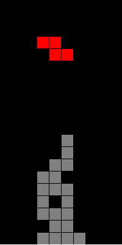

#  js高级01-笔记

[toc]

## 1. day01 能力目标

1. 能够说出面向过程与面向对象的区别
2. 能够使用说出类和对象的区别
3. 能够完成tab栏切换案例


## 2. day02能力目标


# js高级第01天

## 1. 类相关概念

- 面向对象和面向过程的区别
- 类和对象的使用 - 调用类的实例和方法
- 类和实例对象的区别

### 1.1 面向对象编程介绍

面向对象和面向过程的区别以及优缺点?

```
区别:
面向过程关注步骤
面向对象关注谁能完成工作找到对应的人,更注重结果
```

- **面向对象**
  - 优点
    - **易维护**、**易复用**、**易扩展**，由于面向对象有封装、继承、多态性的特性，可以设计出低耦合的系统，使系统更加灵活、更加易于维护 
  - 缺点
    - 性能比面向过程低 
- **面向过程**
  - 优点
    - **性能比面向对象高**，因为类调用时需要实例化，开销比较大，比较消耗资源;比如单片机、嵌入式开发、Linux/Unix等一般采用面向过程开发，性能是最重要的因素。 
    - 不易维护、不易复用、不易扩展 


###  面向对象的应用场景



```html
很多游戏类型的项目都是用面向对象做到
包括我们之前学到的jquery 也是用$这个对象去调用的 也是面向对象
还有今天要学习的tab栏切换也是面向对象

总结:万物皆对象
```


## 2. 类的封装

### 2.1 类和对象

以前声明类用什么关键字?方式是?


```javascript
function Star(uname, age, sex) {
    this.name = uname;
    this.age = age;
    this.sex = sex;
    this.sing = function(sang) {
        console.log(sang);

    }
}

var ldh = new Star('刘德华', 18, '男'); 
console.log(ldh);
```


现在声明类用什么关键字?

类和对象的区别是?


```javascript
声明类的关键字是class

类抽象了对象的公共部分,他泛指一大类
对象特指某一个,通过实例化一个简单的对象

类是一系列事物的统称，同类事物必定具有相同的特征，类在日常生活中是看不到的
对象是一个类的具体表现形式，日常生活中看到的全是对象
```


思考:

分析下列哪些是对象

- 建筑工人
- 市长
- 红烧带鱼
- 我家的狗“多多”
- 左边同桌最新买的笔记本电脑
- 厕所


### 2.2 创建类和生成实例


```javascript
 // 1. 创建类 class  创建一个 明星类
 class Star {
 constructor(uname, age) {
 this.uname = uname;
 this.age = age;
 }
 }

// 2. 利用类创建对象 new
var ldh = new Star('刘德华', 18);
var zxy = new Star('张学友', 20);
console.log(ldh);
console.log(zxy);

通过一个类 可以创建出多个实例对象
```


### 2.3 类中添加共有方法

类中添加方法需要function吗?

类中的方法是通过谁去调用的?

```javascript
// 1. 创建类 class  创建一个 明星类
class Star {
    // 类的共有属性放到 constructor 里面
    constructor(uname, age) {
        this.uname = uname;
        this.age = age;
    }
    sing(song) {
        // console.log('我唱歌');
        console.log(this.uname + song);
    }
}

// 2. 利用类创建对象 new
var ldh = new Star('刘德华', 18);
var zxy = new Star('张学友', 20);
console.log(ldh);
console.log(zxy);
// (1) 我们类里面所有的函数不需要写function 
//(2) 多个函数方法之间不需要添加逗号分隔
ldh.sing('冰雨');
zxy.sing('李香兰');
```

```javascript
在es6之后 声明类用的是class 所以语法有写改变 并且类中的方法直接声明即可 不需要function
类中的方法是通过实例对象去调用的
```


## 3. 类的继承

### 3.1 类继承extends和super关键字

为什么需要继承?

继承的关键字是什么?


```
如果父类有100个方法 子类也有100个方法
如果按照以前的写法  就需要重复的写100种方法了,而使用继承能够很好的减少代码量,并且子类也能拓展自己的方法

super关键字:JS中super关键词是用来调用原型对象的属性和方法的,目前理解为super指向父类即可
```

```javascript
class Father {
    constructor(x, y) {
        this.x = x;
        this.y = y;
    }
    sum() {
        console.log(this.x + this.y);

    }
}
class Son extends Father {
    constructor(x, y) {
        super(x, y); //调用了父类中的构造函数
    }
}
var son = new Son(1, 2);
var son1 = new Son(11, 22);
son.sum();
son1.sum();
```

**练习**(5分钟)

1. 进阶练习: 动物类有名字,年龄的属性,狗类有名字年龄和品种的属性,用继承如何写?


### 3.2 super调用父类普通函数以及继承中属性方法查找原则

如果父类有一个say方法,子类也有一个say方法,那么调用父类对象的say和子类对象的say会相同吗?

```javascript
class Father {
    say() {
        return '我是爸爸';
    }
}
class Son extends Father {
    say() {
        // console.log('我是儿子');
        console.log(super.say() + '的儿子');
        // super.say() 就是调用父类中的普通函数 say()
    }
}
var son = new Son();
son.say();


```


**练习**(5分钟)

1. 动物类有吃喝跑睡的方法 狗类继承动物类,并且狗类也有吃喝跑睡的方法,并且重写跑方法,最后调用狗类的跑方法和动物类的跑方法.


### 3.3 super必须放到子类this之前

子类可以添加自己的独有方法吗?

```javascript
class Father {
    constructor(x, y) {
        this.x = x;
        this.y = y;
    }
    sum() {
        console.log(this.x + this.y);
    }
}
// 子类继承父类加法方法 同时 扩展减法方法
class Son extends Father {
    constructor(x, y) {
        // 利用super 调用父类的构造函数
        // super 必须在子类this之前调用
        super(x, y);
        this.x = x;
        this.y = y;
    }
    subtract() {
        console.log(this.x - this.y);
    }
}
var son = new Son(5, 3);
son.subtract();
son.sum();

注意:super要写在this的前面
```

**练习**(5分钟)

1. 动物类有吃喝跑睡的方法 狗类继承动物类,并且狗类有自己叫的方法,并且调用狗类的叫方法和跑的方法


### 3.4 使用类2个注意点

```javascript
1.现有类再有实例化 (先有了女朋友才能跟女朋友一起睡觉,才能...)
2.类里面的属性需要this调用
```


## 3.5 类里面this指向问题


```javascript
案例分析:
class Person {
    constructor(name) {
        this.loverName = name;
    }
    look(name) {
        this.loverName = name;
    }
}
var zzw = new Person('刘亦菲');
console.log(zzw.loverName);
zzw.look("马爸爸");
console.log(zzw.loverName);


```


